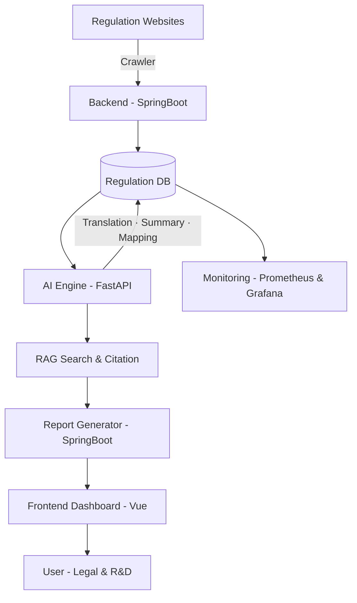

# 🧠 REMON AI – Regulation Monitoring & Intelligence System

**Team Global17**

> 해외 담배 규제 수집 → 번역 → 요약 → 제품 매핑 → 리포트 자동화를 통합한
> **AI 기반 규제 대응 자동화 플랫폼 (Regulatory Intelligence Platform)**

---

## 🎯 Overview

**REMON AI**는 국가별 규제 정보를 자동으로 수집하고,
AI가 번역·요약·의미 매핑을 수행하여
제품별 영향도와 근거 리포트를 생성하는 **End-to-End RegTech 시스템**입니다.

---

## 🧩 Core Features

| 기능                    | 설명                                    |
| --------------------- | ------------------------------------- |
| **F1. 규제 수집·변경탐지**    | 각국 기관 사이트 크롤링 및 조항 단위 버전 비교           |
| **F2. 문서 처리·번역·요약**   | OCR → 언어감지 → Glossary 번역·요약 자동화       |
| **F3. 규제–제품 매핑·영향평가** | 규제 조항과 제품 속성 자동 매핑 (Rule + Embedding) |
| **F4. RAG 검색·근거 추적**  | 근거 기반 LLM 응답 + Faithfulness 검증        |
| **F5. 리포트·대시보드**      | 자동 리포트(PDF/HTML) + 트렌드 시각화            |

---

## ⚙️ Tech Stack

| 영역            | 기술                                      |
| ------------- | --------------------------------------- |
| **Backend**   | Spring Boot, MyBatis, Quartz            |
| **AI Engine** | FastAPI, Python, LangChain, HuggingFace |
| **Frontend**  | Vue.js, Tailwind, Recharts              |
| **Database**  | PostgreSQL                              |
| **Infra**     | Docker, AWS EKS, Prometheus, Grafana    |

---

## 🏗 System Architecture



---

## 🚀 Quick Start

### 1️⃣ Clone Repository

```bash
git clone https://github.com/gksl5355/remon.git
cd remon
```

### 2️⃣ Run via Docker Compose

```bash
docker-compose up --build
```

| 서비스       | URL                                            | 설명              |
| --------- | ---------------------------------------------- | --------------- |
| Backend   | [http://localhost:8080](http://localhost:8080) | Spring Boot API |
| AI Engine | [http://localhost:5000](http://localhost:5000) | FastAPI AI 서버   |
| Frontend  | [http://localhost:3000](http://localhost:3000) | Vue 대시보드        |

---

## 📂 Project Structure

```
remon/
├─ backend/         # Spring Boot API Server
│  ├─ src/
│  ├─ pom.xml
│  └─ README.md
│
├─ ai-engine/       # FastAPI AI Engine
│  ├─ app/
│  ├─ requirements.txt
│  └─ README.md
│
├─ frontend/        # Vue.js Dashboard
│  ├─ src/
│  ├─ package.json
│  └─ README.md
│
├─ docs/            # 문서/설계/기획
│  ├─ business-definition.md
│  ├─ schema/
│  └─ README.md
│
└─ data/            # 테스트용 샘플데이터
   ├─ sample_regulations/
   ├─ sample_products/
   └─ README.md
```

---

## 🤖 AI Module Overview

AI 엔진(`ai-engine/`)은 문서 전처리부터 번역, 요약, 매핑, RAG 검색까지 담당합니다.

| 모듈            | 기능                                  |
| ------------- | ----------------------------------- |
| `ocr`         | PDF/Image 문서 텍스트 추출                 |
| `translation` | Glossary 기반 다국어 번역                  |
| `summary`     | 조항 핵심 요약 (shall/should/prohibit 구분) |
| `mapping`     | 규제-제품 의미 매핑 및 영향도 계산                |
| `rag`         | 벡터 검색 + 근거 기반 응답 생성                 |

---

## 🧮 Key Metrics (MVP)

| 지표             | 목표    |
| -------------- | ----- |
| 규제 변경 탐지 재현율   | ≥ 85% |
| 번역 용어 일치율      | ≥ 90% |
| 매핑 정확도 (Top-1) | ≥ 70% |
| RAG 근거 일치율     | ≥ 80% |
| 리포트 생성 시간      | ≤ 1분  |

---

## 📅 Project Schedule

| 단계             | 기간            | 주요 산출물            |
| -------------- | ------------- | ----------------- |
| 기획·설계          | 10.28 ~ 11.15 | 기능정의서, UI 설계, WBS |
| MVP 개발 (F1~F5) | 11.01 ~ 11.20 | End-to-End 프로토타입  |
| 중간평가           | 11.21         | 기능 시연             |
| 테스트·검증         | 12.08 ~ 12.23 | UT/IT/UAT 결과      |
| 배포 및 운영        | 12.26 ~ 01.05 | 운영환경(EKS) 구축, 매뉴얼 |

---

## 👥 Team Global17

|                                                 이름                                                 |    역할    | 주요 담당                          |                      GitHub                      |
| :------------------------------------------------------------------------------------------------: | :------: | :----------------------------- | :----------------------------------------------: |
|   <br>**조태환**   |  PM / BE | 프로젝트 관리, 수집·스케줄러, Diff 관리      |     [@gksl5355](https://github.com/gksl5355)     |
|   <br>**김민제**  |    AI    | OCR/번역/요약 파이프라인, RAG 설계, 모델 튜닝 |    [@minje0520](https://github.com/minje0520)    |
|  <br>**박선영**  |    FE    | 대시보드·리포트 UI, Glossary 관리 화면    |   [@sunyoungpk](https://github.com/sunyoungpk)   |
|   <br>**남지수**   |    BE    | 리포트 생성 API, Auth/배포 파이프라인 구축   |     [@jisu-nam](https://github.com/jisu-nam)     |
|    <br>**고서아**   |    BE    | Glossary 관리 API, 제품 매핑 DB 설계   |      [@seoa-go](https://github.com/seoa-go)      |
| <br>**조영우** | BE  | EKS 배포, 데이터 연동, 모니터링 환경 구성     | [@youngwoo-cho](https://github.com/youngwoo-cho) |

---

## 📬 Contact

**KT&G Global Regulation AI Automation Project**
✉️ [regulation.ai.team@gmail.com](mailto:regulation.ai.team@gmail.com)

---

🧩 **Version:** v1.3 (2025.11)
🔄 *Last updated by Team Global17*

---
