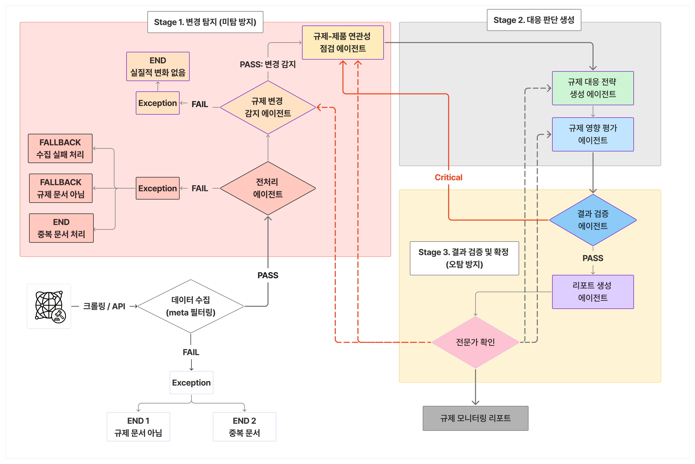

# 시스템 아키텍처

본 문서는 REMON(Regulation Monitoring & Mapping System)에서 **현재 확보된 아키텍처 범위**만을 기준으로 정리한 문서입니다.

REMON에서 실제로 정의되어 있고 설명 가능한 아키텍처는 다음 두 가지입니다.

* **계층적 서비스 아키텍처**: 배포 단위 기준의 서비스 역할 분리
* **에이전트 서비스 플로우**: AI 에이전트들의 실제 처리 흐름

---

## 1. 아키텍처 범위

본 문서에서 다루는 범위는 다음과 같습니다.

* 규제 문서가 시스템에 입력된 이후의 처리 흐름
* AI 에이전트 간 단계적 실행 순서
* Frontend / Backend / AI / Data 단위의 서비스 분리

다음 항목은 의도적으로 포함하지 않습니다.

* 세부 알고리즘 및 프롬프트 구현
* 성능 최적화, 운영 정책
* 추상적인 설계 철학이나 장기 확장 계획

---

## 2. 계층적 서비스 아키텍처

REMON은 배포 및 책임 기준으로 다음과 같이 서비스가 분리되어 있습니다.

* **Frontend**
  사용자 입력, 처리 상태 표시, 결과 리포트 조회

* **Backend API**
  요청 제어, 처리 상태 관리, AI 서비스 호출

* **AI Service**
  규제 분석 에이전트 실행 및 플로우 제어

* **Data Storage**
  규제 문서, 분석 결과, 메타데이터 저장

각 계층은 독립적인 서비스 단위로 배포되며,
역할 구분 이상의 의미를 부여하지 않습니다.

---

## 3. 에이전트 서비스 플로우 (AI 워크플로우)

에이전트 서비스 플로우는 규제 문서가 처리되는 **실제 실행 순서**를 의미합니다.

일반적인 처리 흐름은 다음과 같습니다.

1. 규제 문서 입력
2. 전처리 및 구조화
3. 규제 변경 감지
4. 제품 매핑
5. 영향도 분석
6. 리포트 생성

각 단계는 하나의 에이전트 또는 에이전트 그룹으로 구성되며,
이전 단계의 출력만을 입력으로 받아 순차적으로 실행됩니다.

AI 단계에서는 판단을 확정하지 않으며,
모든 결과는 이후 HITL 단계에서 검증 대상이 됩니다.

---

구현 상세는 코드와 다른 문서에서 다룹니다.
